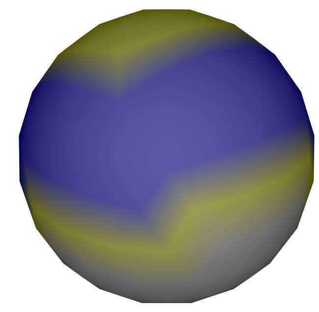
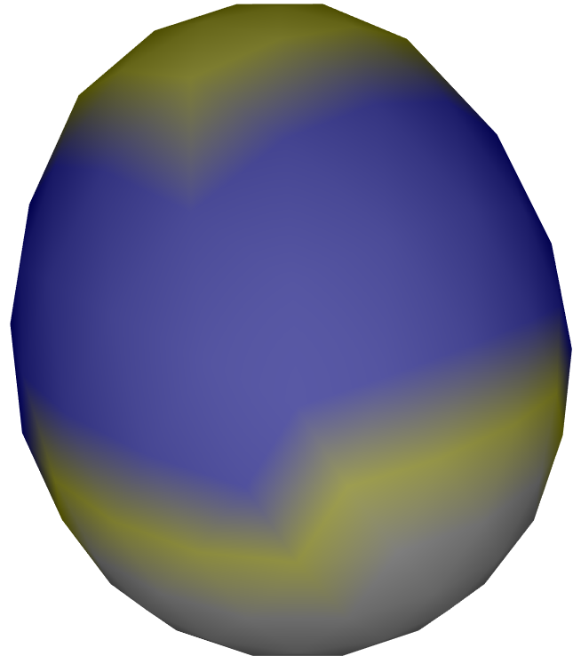

laplacian deformation module
=====================

To run a minimal example do:

    npm run minimal

To run a more advanced demo do:

    npm run start

In our current API, we load the module as

```javascript
require("laplacian-deformation").load(function(initModule,prepareDeform, doDeform, freeModule) {
// code that uses the API here.
}
```

The API consists of four methods. We describe them below.

### `initModule(mesh)`

initializes the module for doing deformation on `mesh`. Must be called
before any other methods in the API.

### `prepareDeform(handles, unconstrained, stationary)`

Does precalculations necessary for performing deformation on a region
of vertices of the mesh. Note that this is a slow operation that
performs performs cholesky decomposition!

* `handles`. vertices that can be freely manipulated.

* `unconstrained` these are vertices that are free, and are solved for
  in the laplacian deformation calculations.

* `boundary` These vertices specifies the boundary of the region
  we are performing deformation on.

Some images will serve to clarify the meaning of the above
parameters.



In the image, `handles` is yellow, `unconstrained` is blue, `boundary`
is red, and the gray region are vertices not affected by the
deformation. Only yellow, blue and red vertices are affected by the deformation.

The user of the library deforms the mesh by setting the positions of
the `handles` vertices by calling `doDeform`. One possible
deformation can look like the below:



It is shown in `minimal/minimal.js` how this deformation was done.

### `deDeform(handlesPositions)`

After calling `prepareDeform()`, we can use `doDeform()` to specify
the positions of the `handles` vertices, and thus deform the
mesh. Returns the vertex coordinates of the deformed mesh.

* `handlesPositions` is simply an array of coordinates of the
format `[[x,y,z], [x,y,z], ...]`. The first coordinate sets the
positions of the handle `handles[0]`, and so on.
